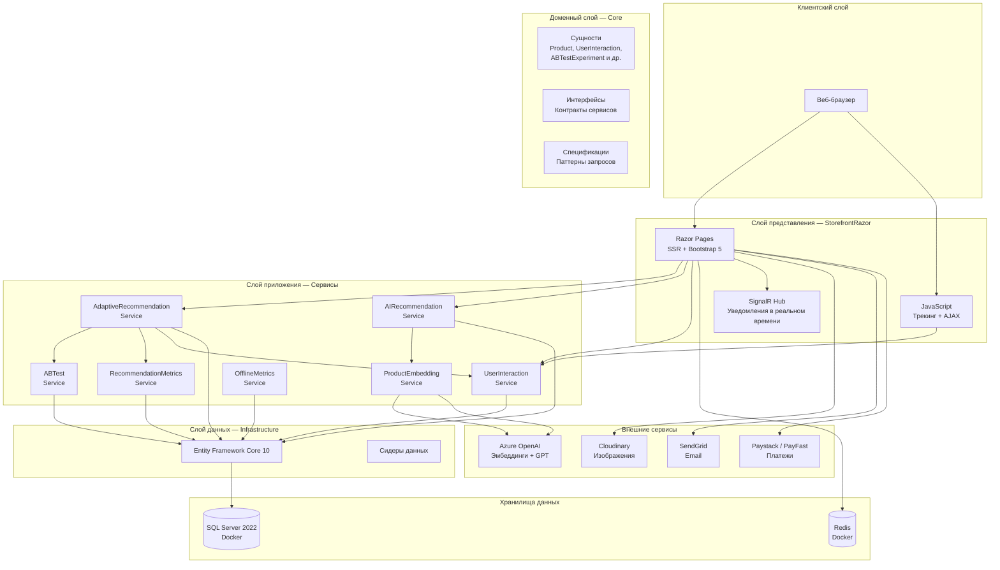
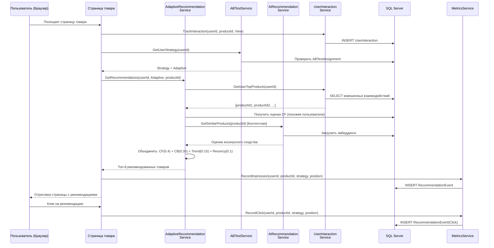
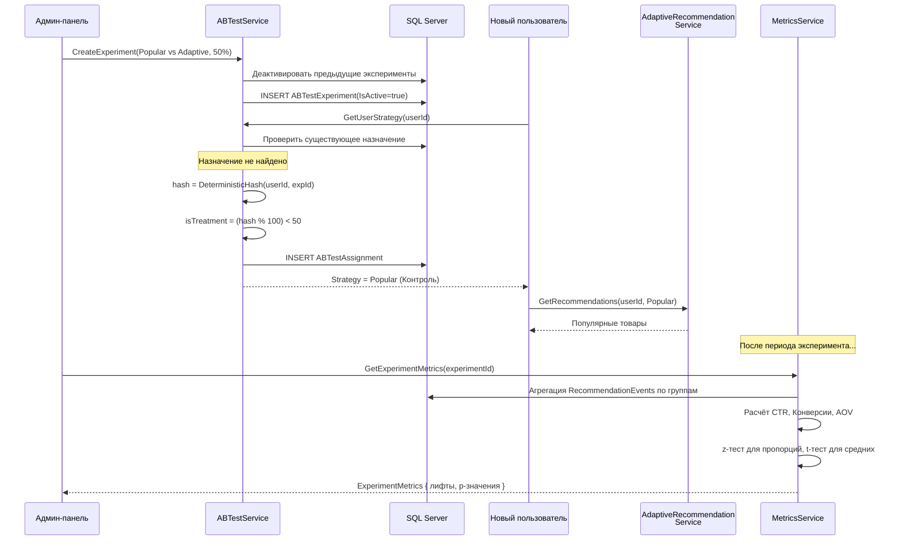
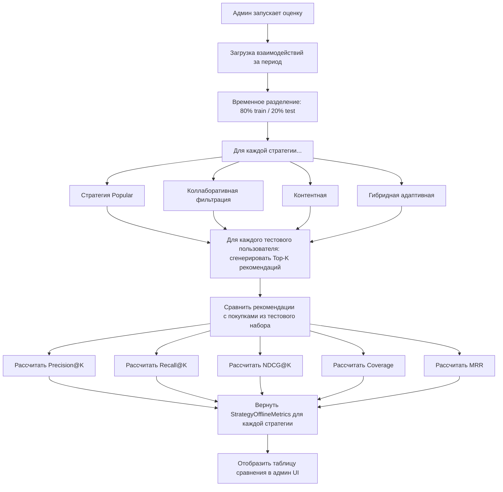
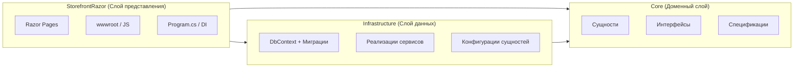
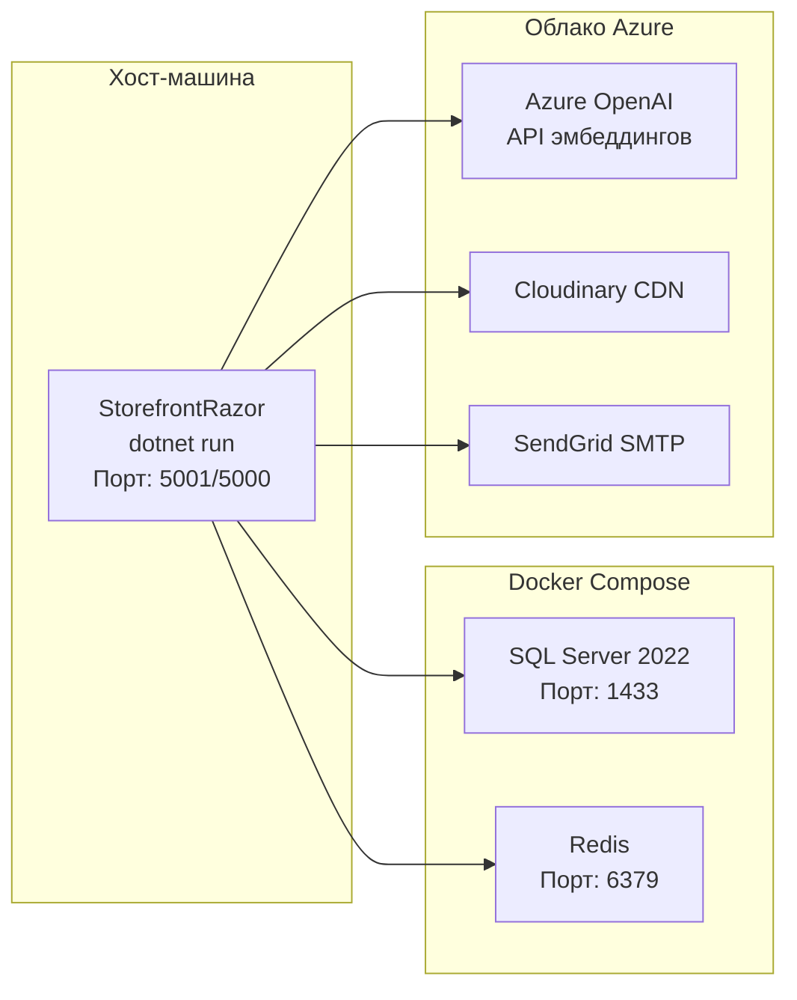

# 02 — Архитектура системы

## Диаграмма верхнего уровня

---

## Поток работы рекомендательной системы

---

## Поток A/B тестирования

---

## Поток Offline-оценки

---

## Слои Clean Architecture

**Правило зависимостей:** Внутренние слои ничего не знают о внешних слоях. Core не имеет зависимостей от Infrastructure или StorefrontRazor.

---

## Архитектура развёртывания (Docker)

---

## Используемые паттерны проектирования

| Паттерн | Где используется | Назначение |
|---------|-------|---------|
| **Clean Architecture** | Структура проекта | Разделение ответственности, тестируемость |
| **Repository / DbContext** | `StoreContext` | Абстракция доступа к данным |
| **Specification** | `Core/Specifications/` | Переиспользуемые, составные запросы |
| **Strategy** | `RecommendationStrategy` enum | Переключение между алгоритмами рекомендаций |
| **Dependency Injection** | `Program.cs` | Слабое связывание, тестируемость |
| **Observer** | `IntersectionObserver` (JS) | Отслеживание показов рекомендаций |
| **Deterministic Hashing** | `ABTestService` | Устойчивое назначение пользователя в группу |
| **Decorator** | Атрибут `[Cached]` | Прозрачное кэширование ответов |
