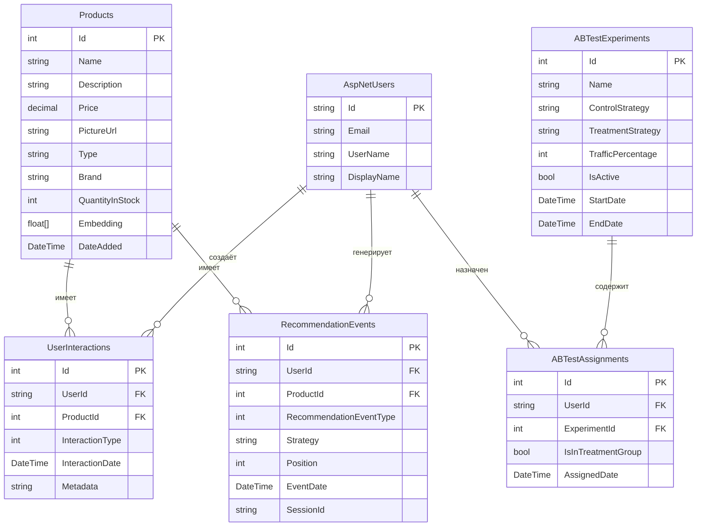

# 04 — Схема базы данных

## ER-диаграмма (основные таблицы рекомендательной системы)



---

## Описание таблиц

### 1. Products (Товары)

| Колонка | Тип | Описание |
|---------|-----|----------|
| `Id` | int (PK) | Первичный ключ |
| `Name` | nvarchar(200) | Название товара |
| `Description` | nvarchar(max) | Описание |
| `Price` | decimal(18,2) | Цена в валюте |
| `PictureUrl` | nvarchar(500) | URL основного изображения |
| `Type` | nvarchar(100) | Категория (Running, Board и т.д.) |
| `Brand` | nvarchar(100) | Бренд (Nike, Adidas и т.д.) |
| `QuantityInStock` | int | Остаток на складе |
| `Embedding` | nvarchar(max) | JSON-массив float[1536] — вектор Azure OpenAI |
| `DateAdded` | datetime2 | Дата добавления в каталог |

### 2. UserInteractions (Взаимодействия пользователей)

| Колонка | Тип | Описание |
|---------|-----|----------|
| `Id` | int (PK) | Первичный ключ |
| `UserId` | nvarchar(450) (FK) | Ссылка на AspNetUsers |
| `ProductId` | int (FK) | Ссылка на Products |
| `InteractionType` | int | Enum: View=0, Click=1, AddToCart=2, Purchase=3, Wishlist=4, RecommendationClick=5 |
| `InteractionDate` | datetime2 | Время взаимодействия |
| `Metadata` | nvarchar(max) | Дополнительные данные (JSON) |

### 3. RecommendationEvents (События рекомендаций)

| Колонка | Тип | Описание |
|---------|-----|----------|
| `Id` | int (PK) | Первичный ключ |
| `UserId` | nvarchar(450) (FK) | Ссылка на пользователя |
| `ProductId` | int (FK) | Рекомендованный товар |
| `RecommendationEventType` | int | Enum: Impression=0, Click=1, AddToCart=2, Purchase=3 |
| `Strategy` | nvarchar(50) | Какая стратегия сгенерировала (Popular, CF, CB, Adaptive) |
| `Position` | int | Позиция в карусели (1-8) |
| `EventDate` | datetime2 | Время события |
| `SessionId` | nvarchar(100) | Идентификатор сессии |

### 4. ABTestExperiments (Эксперименты A/B тестирования)

| Колонка | Тип | Описание |
|---------|-----|----------|
| `Id` | int (PK) | Первичный ключ |
| `Name` | nvarchar(200) | Название эксперимента |
| `ControlStrategy` | nvarchar(50) | Стратегия контрольной группы |
| `TreatmentStrategy` | nvarchar(50) | Стратегия экспериментальной группы |
| `TrafficPercentage` | int | Процент трафика в экспериментальную группу (0-100) |
| `IsActive` | bit | Активен ли эксперимент |
| `StartDate` | datetime2 | Начало эксперимента |
| `EndDate` | datetime2 (nullable) | Конец эксперимента |

### 5. ABTestAssignments (Назначения в группы)

| Колонка | Тип | Описание |
|---------|-----|----------|
| `Id` | int (PK) | Первичный ключ |
| `UserId` | nvarchar(450) (FK) | Ссылка на пользователя |
| `ExperimentId` | int (FK) | Ссылка на эксперимент |
| `IsInTreatmentGroup` | bit | true = экспериментальная, false = контрольная |
| `AssignedDate` | datetime2 | Дата назначения |

---

## Индексы

```sql
-- Быстрый поиск взаимодействий пользователя
CREATE INDEX IX_UserInteractions_UserId_InteractionDate 
ON UserInteractions(UserId, InteractionDate DESC);

-- Получение взаимодействий по товару (для CF)
CREATE INDEX IX_UserInteractions_ProductId_InteractionType
ON UserInteractions(ProductId, InteractionType);

-- Фильтрация событий по стратегии и дате
CREATE INDEX IX_RecommendationEvents_Strategy_EventDate
ON RecommendationEvents(Strategy, EventDate DESC);

-- Поиск назначения пользователя в эксперимент
CREATE INDEX IX_ABTestAssignments_UserId_ExperimentId
ON ABTestAssignments(UserId, ExperimentId) INCLUDE (IsInTreatmentGroup);

-- Активные эксперименты
CREATE INDEX IX_ABTestExperiments_IsActive
ON ABTestExperiments(IsActive) WHERE IsActive = 1;
```

---

## Типы взаимодействий (Enum)

```csharp
public enum InteractionType
{
    View = 0,              // Просмотр карточки товара
    Click = 1,             // Клик по товару из списка
    AddToCart = 2,         // Добавление в корзину
    Purchase = 3,          // Покупка
    Wishlist = 4,          // Добавление в избранное
    RecommendationClick = 5 // Клик по рекомендации
}
```

---

## Типы событий рекомендаций (Enum)

```csharp
public enum RecommendationEventType
{
    Impression = 0,  // Рекомендация показана пользователю
    Click = 1,       // Пользователь кликнул по рекомендации
    AddToCart = 2,   // Добавил рекомендованный товар в корзину
    Purchase = 3     // Купил рекомендованный товар
}
```

---

## Объём данных (Seeded/Синтетические)

| Таблица | Количество записей | Описание |
|---------|-------------------|----------|
| Products | 50 | Товары из JSON-сида |
| AspNetUsers | 20 | Тестовые пользователи |
| UserInteractions | ~15 000 | 20 пользователей × 50 товаров × ~15 типов за 30 дней |
| RecommendationEvents | ~6 000 | Сгенерированные показы и клики |
| ABTestExperiments | 1 | Popular vs Adaptive, 50% трафика |
| ABTestAssignments | 20 | По одному на пользователя |

---

## Конфигурация Entity Framework Core

**Файл:** `Infrastructure/Config/` — отдельный файл конфигурации для каждой сущности

Пример для эмбеддингов:
```csharp
builder.Property(p => p.Embedding)
    .HasConversion(
        v => JsonSerializer.Serialize(v, (JsonSerializerOptions)null),
        v => JsonSerializer.Deserialize<float[]>(v, (JsonSerializerOptions)null))
    .HasColumnType("nvarchar(max)");
```

Эмбеддинги хранятся как JSON-строка в колонке `nvarchar(max)`, потому что SQL Server не поддерживает нативные типы массивов. Конвертация происходит автоматически через EF Core Value Conversion.
