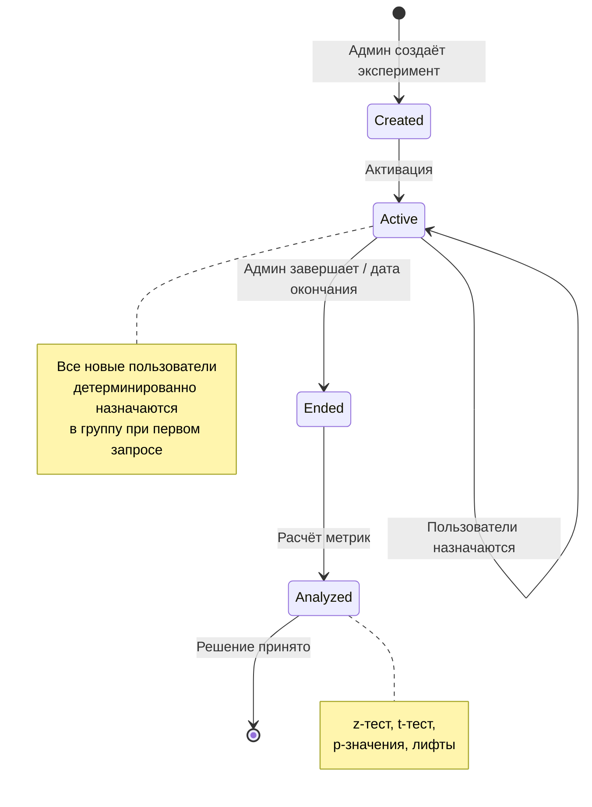
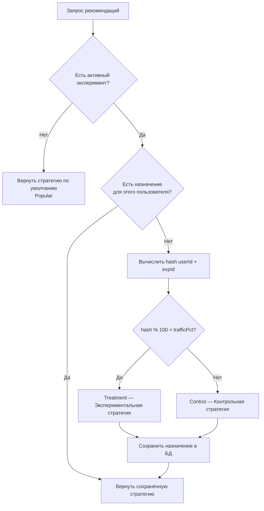

# 05 — A/B Тестирование

## Обзор

Система A/B тестирования позволяет сравнивать эффективность разных стратегий рекомендаций на реальных пользователях. Каждый пользователь детерминированно назначается в контрольную или экспериментальную группу.

**Файл:** `Infrastructure/Services/ABTestService.cs`

---

## Алгоритм детерминированного хеширования

Назначение пользователя в группу основано на **детерминированной хеш-функции**, что гарантирует:
- Один и тот же пользователь всегда попадает в одну и ту же группу
- Нет необходимости хранить назначение до первого вычисления
- Распределение близко к равномерному

### Реализация:

```csharp
private static int DeterministicHash(string userId, int experimentId)
{
    string input = $"{userId}-{experimentId}";
    int hash = 17; // начальное значение (seed)
    
    foreach (char c in input)
    {
        hash = hash * 31 + c; // множитель
    }
    
    return Math.Abs(hash);
}
```

### Параметры хеш-функции:

| Параметр | Значение | Описание |
|----------|----------|----------|
| Seed | 17 | Начальное значение хеша |
| Multiplier | 31 | Множитель (простое число для равномерного распределения) |
| Вход | `"{userId}-{experimentId}"` | Конкатенация ID пользователя и эксперимента |

### Формула назначения в группу:

$$
\text{group} = \begin{cases}
\text{Treatment (экспериментальная)} & \text{если } \text{hash}(\text{userId}, \text{expId}) \bmod 100 < \text{trafficPct} \\
\text{Control (контрольная)} & \text{иначе}
\end{cases}
$$

При `trafficPct = 50` получаем равное разделение 50/50.

---

## Жизненный цикл эксперимента



---

## Создание эксперимента

При создании нового эксперимента:

1. **Деактивируются** все предыдущие активные эксперименты
2. **Создаётся** новый с `IsActive = true`
3. Назначения создаются **лениво** (при первом запросе рекомендаций)

```csharp
public async Task<ABTestExperiment> CreateExperiment(
    string name,
    string controlStrategy,    // например "Popular"
    string treatmentStrategy,  // например "Adaptive"
    int trafficPercentage)     // например 50
{
    // Деактивировать все текущие
    var active = await _context.ABTestExperiments
        .Where(e => e.IsActive)
        .ToListAsync();
    foreach (var exp in active) exp.IsActive = false;

    // Создать новый
    var experiment = new ABTestExperiment { ... };
    _context.ABTestExperiments.Add(experiment);
    await _context.SaveChangesAsync();
    return experiment;
}
```

---

## Получение стратегии для пользователя



---

## Пример эксперимента

| Параметр | Значение |
|----------|----------|
| Название | «Popular vs Adaptive Q1 2025» |
| Контрольная стратегия | Popular |
| Экспериментальная стратегия | Adaptive |
| Трафик в эксперимент | 50% |
| Начало | 2025-01-15 |
| Продолжительность | 30 дней |

### Ожидаемые результаты (из сидированных данных):

| Метрика | Control (Popular) | Treatment (Adaptive) | Лифт |
|---------|-------------------|---------------------|------|
| CTR | ~8% | ~15% | +87.5% |
| Конверсия (Cart→Purchase) | ~25% | ~40% | +60% |
| Средний чек (AOV) | Базовый | +10-15% | +10-15% |

---

## Статистическая значимость

Результаты эксперимента проверяются на статистическую значимость:

- **z-тест** для пропорций (CTR, конверсия)
- **t-тест Уэлча** для средних (средний чек)
- Уровень значимости: $\alpha = 0.05$

Подробнее — в документе [06-METRICS.md](06-METRICS.md).

---

## Свойство детерминированности

Ключевое преимущество алгоритма: **идемпотентность**.

Для одного и того же пользователя и эксперимента хеш-функция всегда вернёт одинаковый результат:

```
DeterministicHash("user123", 1) = 48291  →  48291 % 100 = 91  →  Control
DeterministicHash("user456", 1) = 23847  →  23847 % 100 = 47  →  Treatment
```

Это означает:
- Нет «переключения» между группами при повторных визитах
- Результаты воспроизводимы
- Не требуется предварительное назначение всех пользователей
