# 09 — UML-диаграммы

> Все диаграммы выполнены в формате Mermaid и могут быть отрисованы в любом Markdown-редакторе, VS Code, или экспортированы в PNG/SVG через [mermaid.live](https://mermaid.live).

---

## 1. Диаграмма классов — Доменный слой (Core)

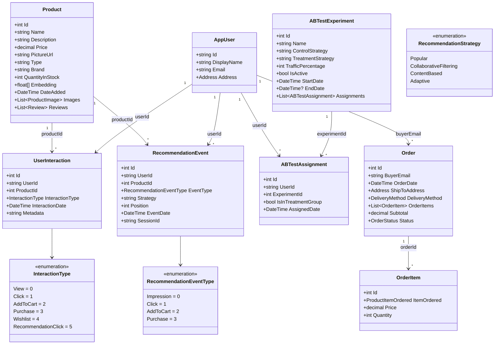

---

## 2. Диаграмма классов — Сервисный слой

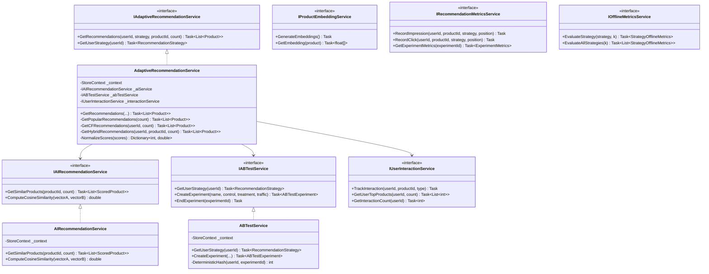

---

## 3. Диаграмма компонентов

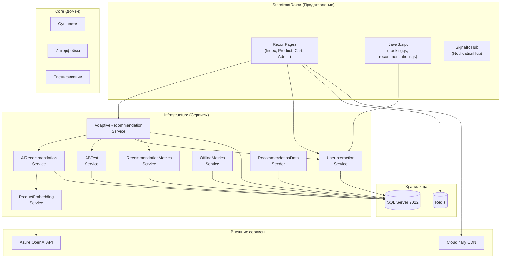

---

## 4. Диаграмма вариантов использования (Use Case)

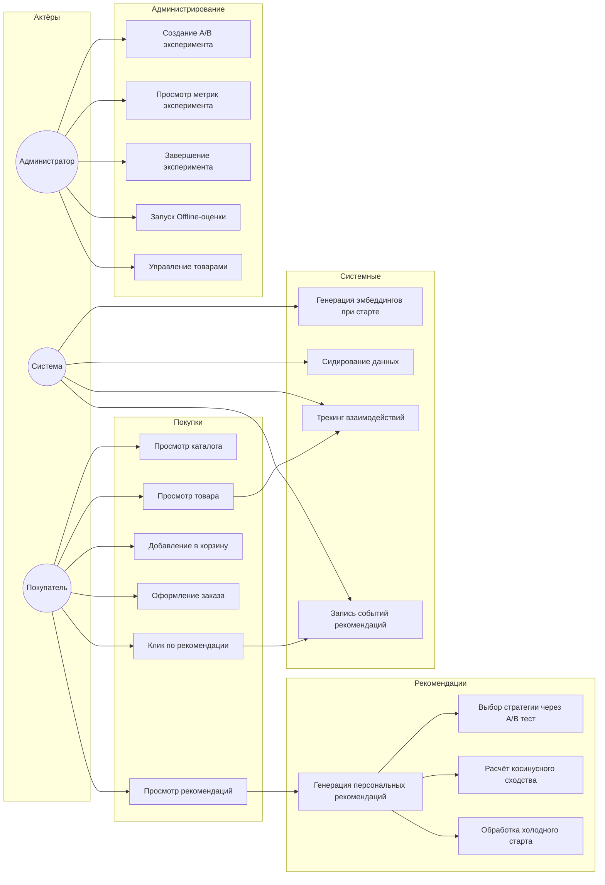

---

## 5. Диаграмма активности — Генерация рекомендаций

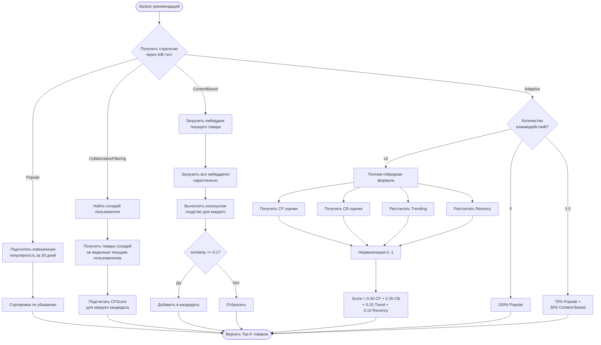

---

## 6. Диаграмма активности — Процесс A/B назначения

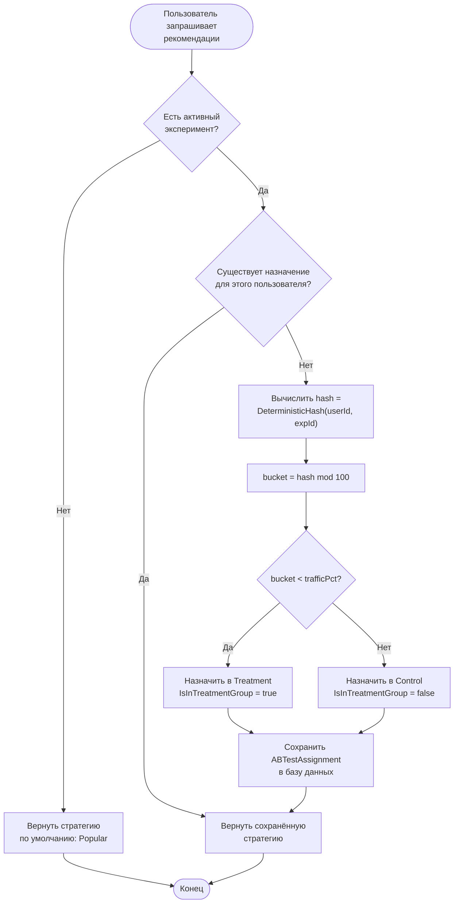

---

## 7. Диаграмма состояний — Жизненный цикл заказа

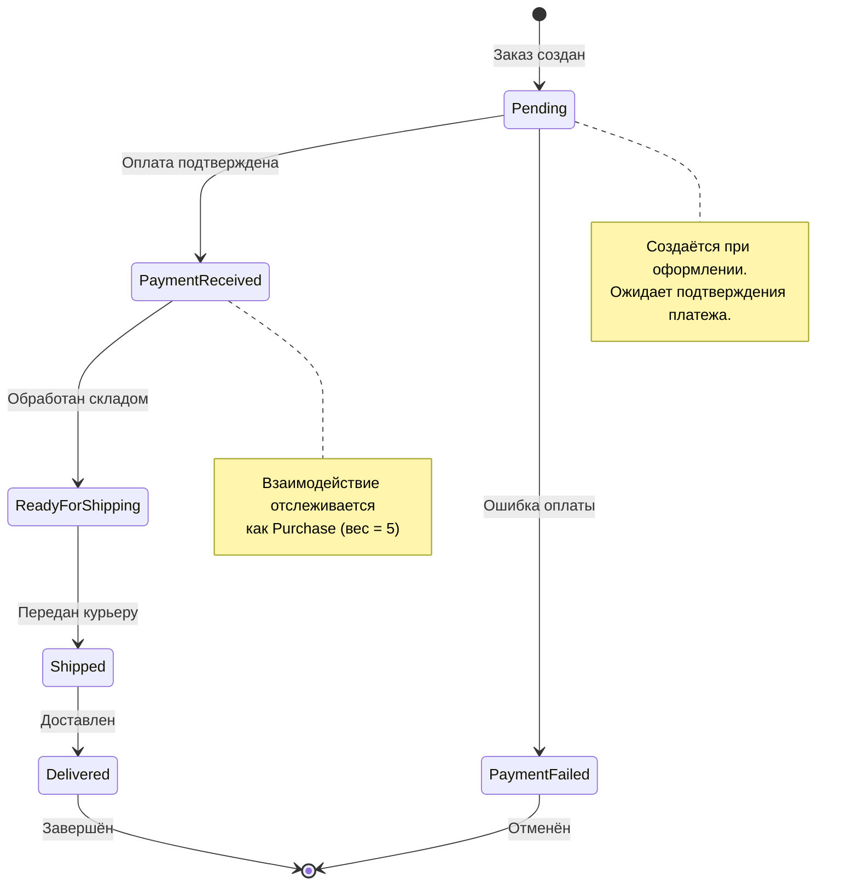

---

## 8. Диаграмма состояний — Жизненный цикл эксперимента

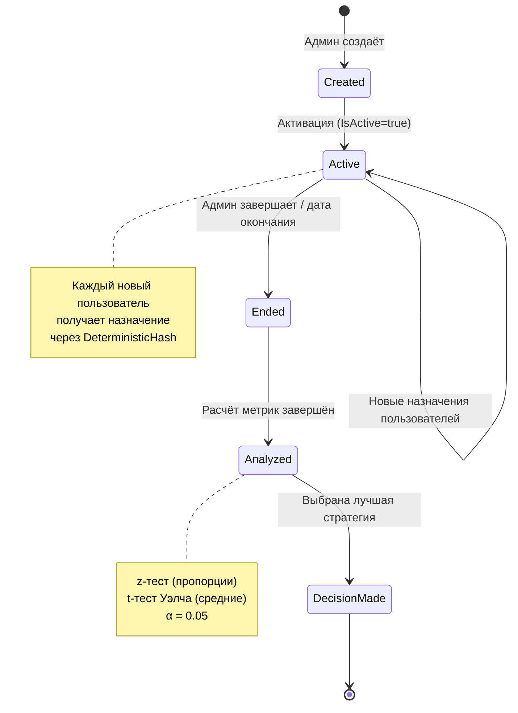

---

## 9. Диаграмма последовательности — Трекинг взаимодействия

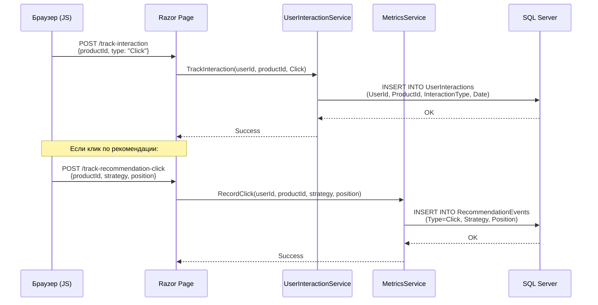

---

## 10. Диаграмма развёртывания (Deployment)

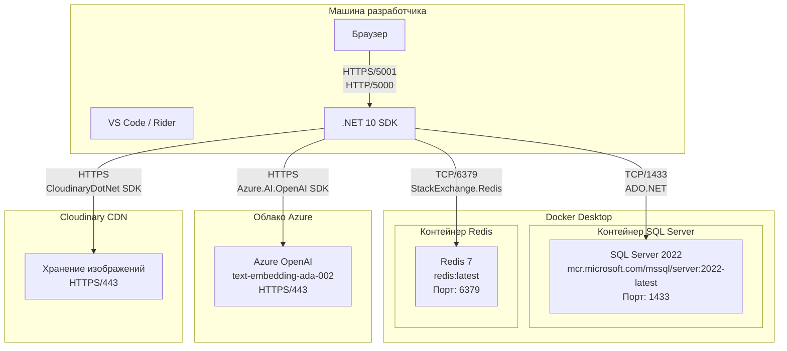

---

## 11. DFD — Контекстная диаграмма (Уровень 0)

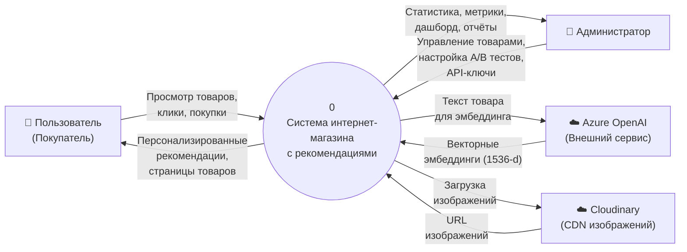

---

## 12. DFD — Диаграмма потоков данных (Уровень 1)

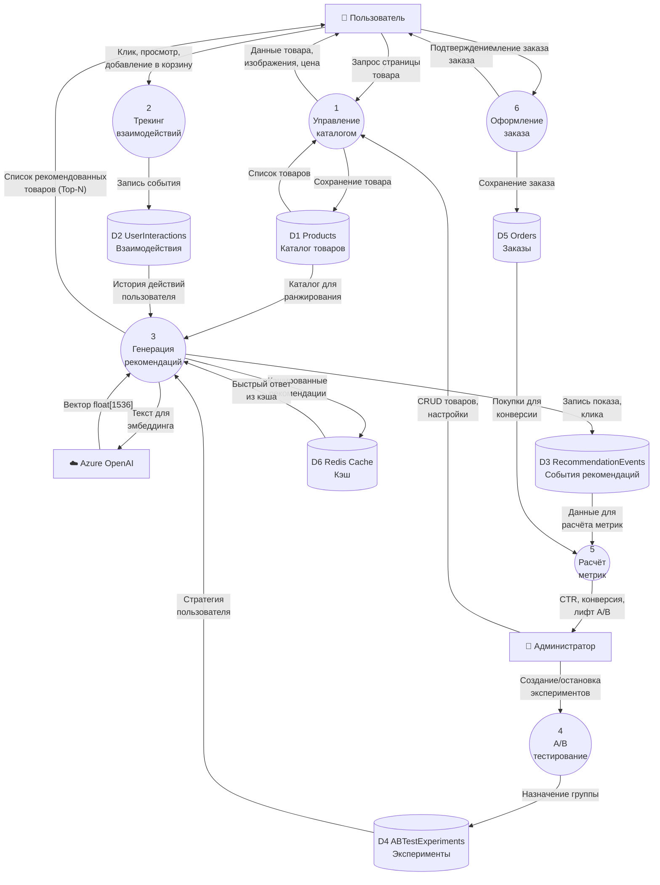

---

## Как использовать в дипломной работе

### Экспорт в изображения:

1. **VS Code**: установить расширение «Markdown Preview Mermaid Support»
2. **Онлайн**: вставить код в [mermaid.live](https://mermaid.live) → Export PNG/SVG
3. **CLI**: `npx @mermaid-js/mermaid-cli mmdc -i diagram.mmd -o diagram.png -w 1200`

### Рекомендации по размещению в тексте:

| Диаграмма | Глава |
|-----------|-------|
| Диаграмма классов (домен) | Глава 2 — Проектирование системы |
| Диаграмма классов (сервисы) | Глава 2 — Проектирование системы |
| Диаграмма компонентов | Глава 2 — Архитектура |
| Варианты использования | Глава 2 — Функциональные требования |
| Активности (рекомендации) | Глава 3 — Алгоритмы |
| Активности (A/B назначение) | Глава 3 — A/B тестирование |
| Состояния (заказ) | Глава 2 — Бизнес-логика |
| Состояния (эксперимент) | Глава 3 — Методология оценки |
| Последовательность (трекинг) | Глава 3 — Сбор данных |
| Развёртывание | Глава 2 — Инфраструктура |
| DFD контекстная (уровень 0) | Глава 2 — Общее описание системы |
| DFD потоков данных (уровень 1) | Глава 2 — Архитектура / Глава 3 — Данные |
