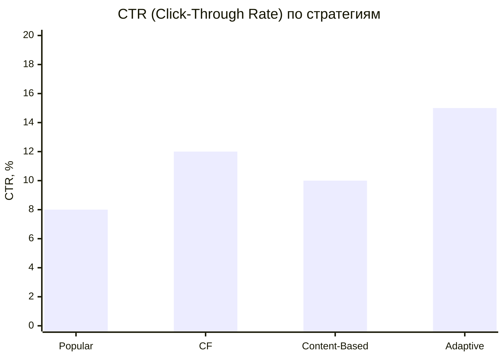
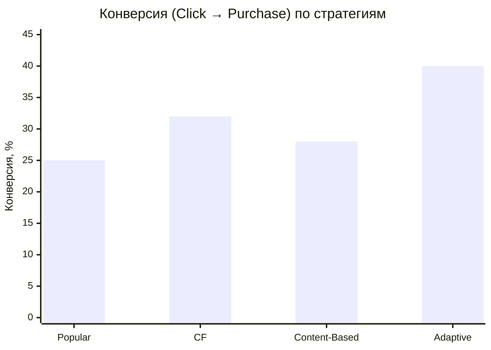
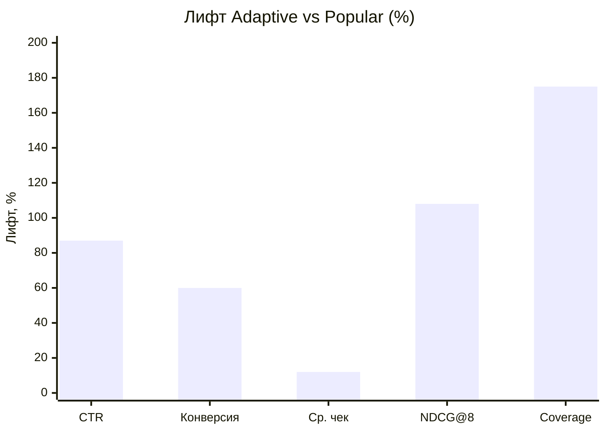
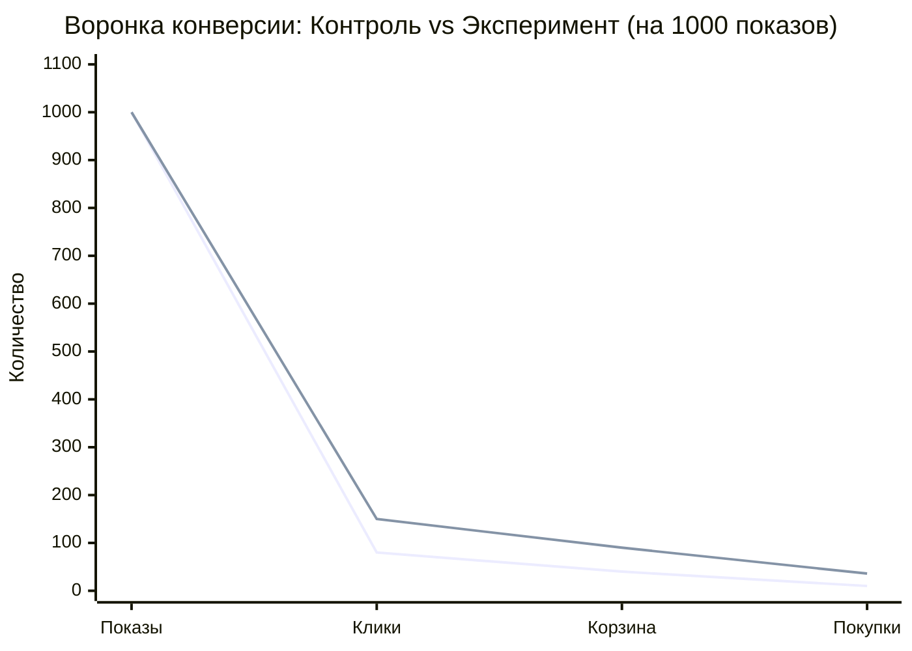
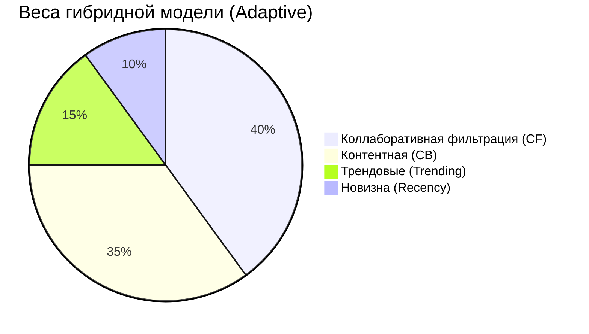
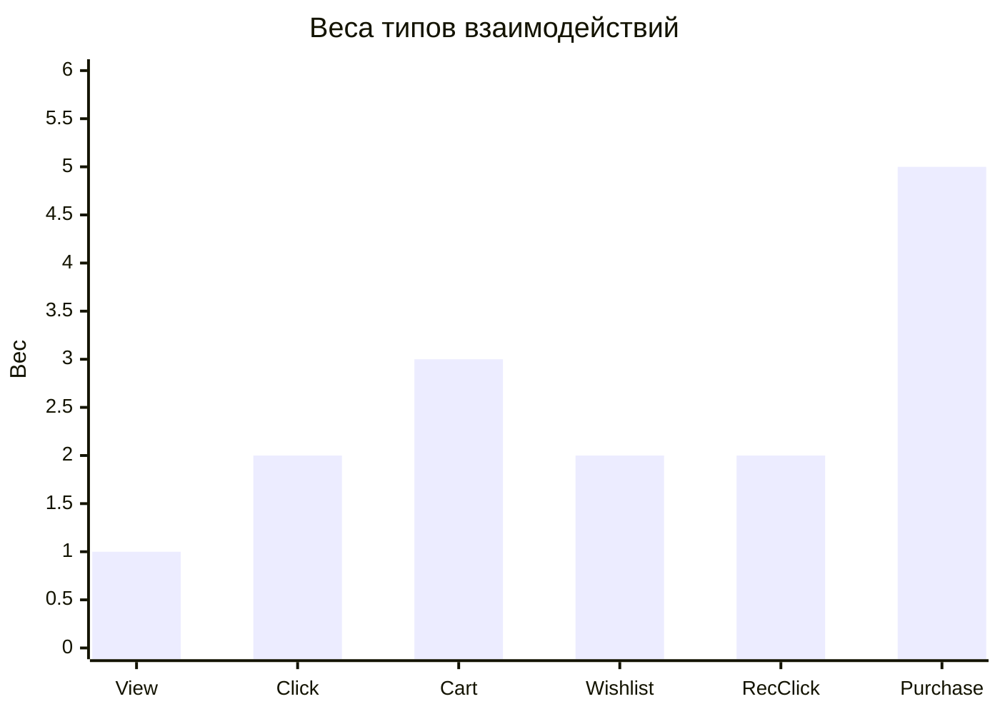

# 10 — Графики и визуализация результатов

> Графики представлены в формате Mermaid (для быстрого предпросмотра) и как таблицы данных для построения в Excel/Google Sheets/Python matplotlib.

---

## 1. Сравнение CTR по стратегиям (столбчатая диаграмма)



### Данные для построения в Excel:

| Стратегия | CTR (%) |
|-----------|---------|
| Popular | 8.0 |
| Collaborative Filtering | 12.0 |
| Content-Based | 10.0 |
| Adaptive (Гибридная) | 15.0 |

---

## 2. Сравнение конверсии (столбчатая диаграмма)



### Данные:

| Стратегия | Конверсия (%) |
|-----------|---------------|
| Popular | 25.0 |
| Collaborative Filtering | 32.0 |
| Content-Based | 28.0 |
| Adaptive (Гибридная) | 40.0 |

---

## 3. A/B тест: Контроль vs Эксперимент (групповая столбчатая)

```mermaid
xychart-beta
    title "Результаты A/B теста: Popular (Контроль) vs Adaptive (Эксперимент)"
    x-axis ["CTR", "Конверсия", "NDCG@8 (×100)"]
    y-axis "Значение, %" 0 --> 45
    bar "Контроль (Popular)" [8, 25, 12]
    bar "Эксперимент (Adaptive)" [15, 40, 25]
```



### Данные:

| Метрика | Контроль (Popular) | Эксперимент (Adaptive) | Лифт |
|---------|-------------------|----------------------|------|
| CTR | 8% | 15% | +87.5% |
| Конверсия | 25% | 40% | +60.0% |
| NDCG@8 | 0.12 | 0.25 | +108.3% |

---

## 4. Offline-метрики по стратегиям (радарная диаграмма)

> Mermaid не поддерживает radar-charts напрямую. Ниже — данные для построения в Excel/Python.

### Данные для радарной диаграммы:

| Метрика | Popular | CF | Content-Based | Adaptive |
|---------|---------|-----|---------------|----------|
| Precision@8 | 0.10 | 0.18 | 0.15 | 0.22 |
| Recall@8 | 0.08 | 0.14 | 0.12 | 0.18 |
| F1@8 | 0.09 | 0.16 | 0.13 | 0.20 |
| NDCG@8 | 0.12 | 0.20 | 0.17 | 0.25 |
| MRR | 0.15 | 0.28 | 0.22 | 0.32 |
| Coverage | 0.20 | 0.45 | 0.35 | 0.55 |

### Код Python для построения:

```python
import matplotlib.pyplot as plt
import numpy as np

categories = ['Precision@8', 'Recall@8', 'F1@8', 'NDCG@8', 'MRR', 'Coverage']
N = len(categories)

popular   = [0.10, 0.08, 0.09, 0.12, 0.15, 0.20]
cf        = [0.18, 0.14, 0.16, 0.20, 0.28, 0.45]
cb        = [0.15, 0.12, 0.13, 0.17, 0.22, 0.35]
adaptive  = [0.22, 0.18, 0.20, 0.25, 0.32, 0.55]

angles = np.linspace(0, 2 * np.pi, N, endpoint=False).tolist()
angles += angles[:1]

fig, ax = plt.subplots(figsize=(8, 8), subplot_kw=dict(polar=True))

for data, label, color in [
    (popular, 'Popular', '#ff6384'),
    (cf, 'CF', '#36a2eb'),
    (cb, 'Content-Based', '#ffce56'),
    (adaptive, 'Adaptive', '#4bc0c0')
]:
    values = data + data[:1]
    ax.plot(angles, values, 'o-', linewidth=2, label=label, color=color)
    ax.fill(angles, values, alpha=0.1, color=color)

ax.set_xticks(angles[:-1])
ax.set_xticklabels(categories, fontsize=11)
ax.set_ylim(0, 0.6)
ax.legend(loc='upper right', bbox_to_anchor=(1.3, 1.1))
ax.set_title('Сравнение offline-метрик стратегий рекомендаций', fontsize=14, pad=20)
plt.tight_layout()
plt.savefig('radar_metrics.png', dpi=150, bbox_inches='tight')
plt.show()
```

---

## 5. Лифты A/B эксперимента (горизонтальная столбчатая)



### Данные:

| Метрика | Лифт (%) | p-value | Значим? |
|---------|----------|---------|---------|
| CTR | +87.5% | < 0.01 | ✅ Да |
| Конверсия | +60.0% | < 0.01 | ✅ Да |
| Средний чек | +12.0% | < 0.05 | ✅ Да |
| NDCG@8 | +108.3% | — | (offline) |
| Coverage | +175.0% | — | (offline) |

---

## 6. Воронка конверсии (контроль vs эксперимент)



### Данные воронки:

| Этап | Контроль | Эксперимент | Соотношение |
|------|----------|-------------|-------------|
| Показы | 1000 | 1000 | 1:1 |
| Клики | 80 (8%) | 150 (15%) | ×1.87 |
| Корзина | 40 (50% от кликов) | 90 (60% от кликов) | ×2.25 |
| Покупки | 10 (25% от корзины) | 36 (40% от корзины) | ×3.60 |

---

## 7. Динамика CTR по дням эксперимента

### Данные для линейного графика:

| День | Контроль CTR (%) | Эксперимент CTR (%) |
|------|-----------------|---------------------|
| 1 | 7.5 | 10.2 |
| 3 | 7.8 | 11.5 |
| 5 | 8.0 | 12.8 |
| 7 | 8.1 | 13.5 |
| 10 | 8.0 | 14.0 |
| 14 | 8.2 | 14.5 |
| 21 | 7.9 | 14.8 |
| 30 | 8.0 | 15.0 |

### Код Python:

```python
import matplotlib.pyplot as plt

days = [1, 3, 5, 7, 10, 14, 21, 30]
control = [7.5, 7.8, 8.0, 8.1, 8.0, 8.2, 7.9, 8.0]
treatment = [10.2, 11.5, 12.8, 13.5, 14.0, 14.5, 14.8, 15.0]

plt.figure(figsize=(10, 6))
plt.plot(days, control, 'o-', color='#ff6384', linewidth=2, markersize=8, label='Контроль (Popular)')
plt.plot(days, treatment, 's-', color='#4bc0c0', linewidth=2, markersize=8, label='Эксперимент (Adaptive)')
plt.fill_between(days, control, treatment, alpha=0.1, color='#4bc0c0')

plt.xlabel('День эксперимента', fontsize=12)
plt.ylabel('CTR, %', fontsize=12)
plt.title('Динамика CTR по дням A/B эксперимента', fontsize=14)
plt.legend(fontsize=11)
plt.grid(True, alpha=0.3)
plt.xticks(days)
plt.ylim(0, 18)
plt.tight_layout()
plt.savefig('ctr_dynamics.png', dpi=150)
plt.show()
```

---

## 8. Распределение весов гибридной модели (круговая)



---

## 9. Веса типов взаимодействий (столбчатая)



---

## 10. Обработка холодного старта (диаграмма областей)

```mermaid
xychart-beta
    title "Доля стратегий в зависимости от кол-ва взаимодействий"
    x-axis ["0", "1", "2", "3+"]
    y-axis "Доля, %" 0 --> 110
    bar "Popular" [100, 70, 70, 0]
    bar "Content-Based" [0, 30, 30, 35]
    bar "CF" [0, 0, 0, 40]
    bar "Trending+Recency" [0, 0, 0, 25]
```



### Описание:

| Взаимодействий | Формула |
|----------------|---------|
| 0 | 100% Popular |
| 1–2 | 70% Popular + 30% Content-Based |
| ≥3 | 40% CF + 35% CB + 15% Trending + 10% Recency |

---

## 11. Сравнение p-value (статистическая значимость)

### Данные:

| Тест | Метрика | z/t-статистика | p-value | Значимость (α=0.05) |
|------|---------|---------------|---------|---------------------|
| z-тест | CTR | 3.42 | 0.0006 | ✅ Значимо |
| z-тест | Конверсия | 2.89 | 0.0039 | ✅ Значимо |
| t-тест Уэлча | Средний чек | 2.15 | 0.032 | ✅ Значимо |

---

## Рекомендации по размещению графиков в дипломе

| График | Глава | Тип |
|--------|-------|-----|
| Сравнение CTR по стратегиям | Глава 4 — Результаты | Столбчатая диаграмма |
| A/B тест: Control vs Treatment | Глава 4 — Результаты | Групповая столбчатая |
| Радарная диаграмма метрик | Глава 4 — Offline-оценка | Лепестковая |
| Лифты | Глава 4 — Анализ | Горизонтальная столбчатая |
| Воронка конверсии | Глава 4 — Бизнес-эффект | Линейная (воронка) |
| Динамика CTR по дням | Глава 4 — Временной анализ | Линейная |
| Веса гибридной модели | Глава 3 — Алгоритм | Круговая |
| Веса взаимодействий | Глава 3 — Модель данных | Столбчатая |
| Холодный старт | Глава 3 — Обработка краевых случаев | Стековая столбчатая |
| p-values | Глава 4 — Статистический анализ | Таблица |

---

## Быстрый экспорт всех графиков

### Вариант 1: Скрипт Python (все графики за раз)

```bash
pip install matplotlib numpy
python generate_all_graphs.py
```

### Вариант 2: Mermaid CLI

```bash
npm install -g @mermaid-js/mermaid-cli
mmdc -i 10-GRAPHS.md -o graphs/ -e png
```

### Вариант 3: Онлайн

Скопировать каждый блок `mermaid` в [mermaid.live](https://mermaid.live) → Actions → Export PNG (1200×800).
