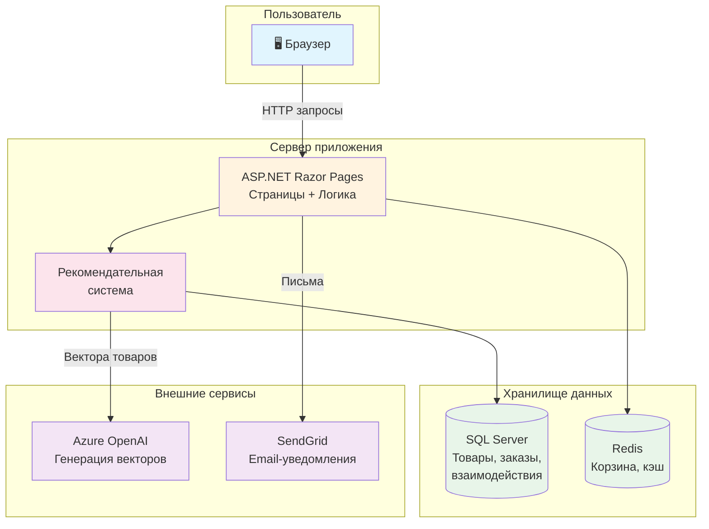
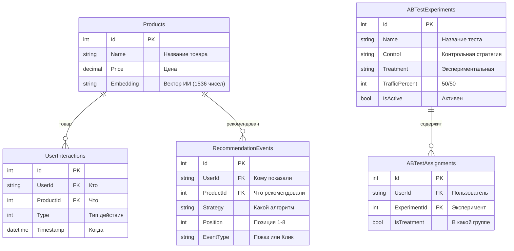
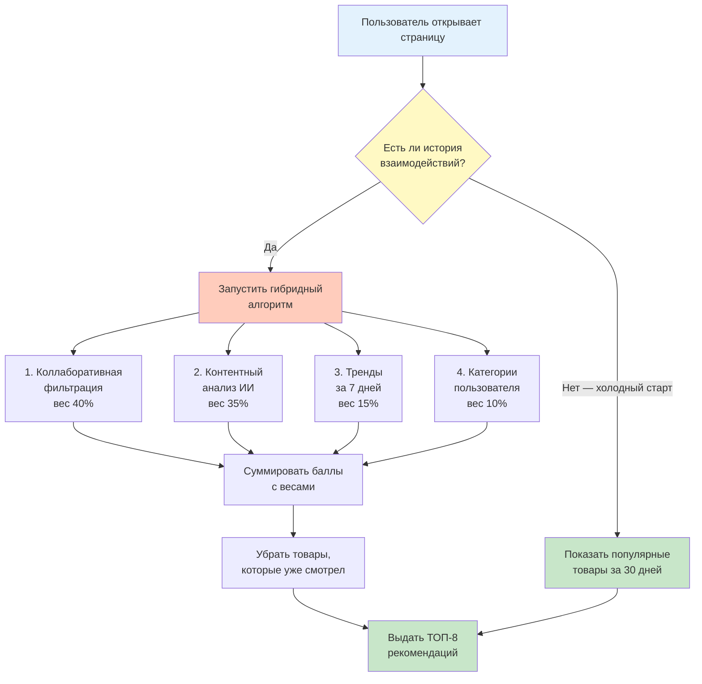
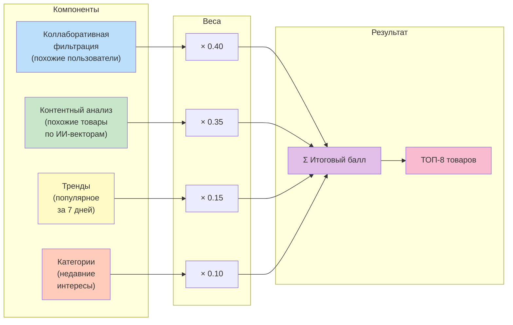
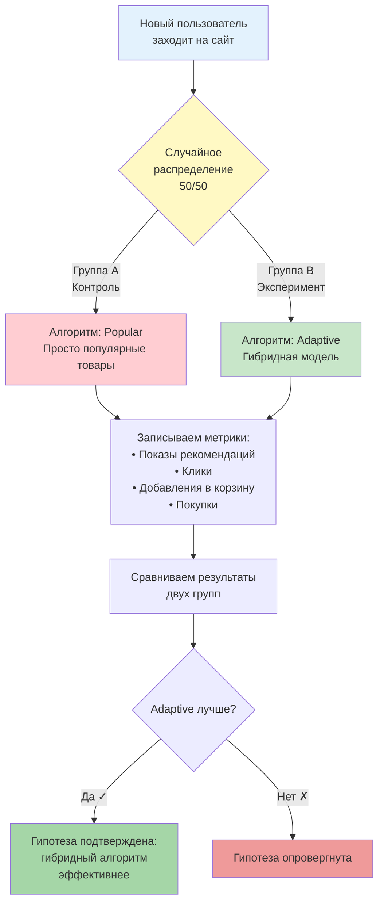
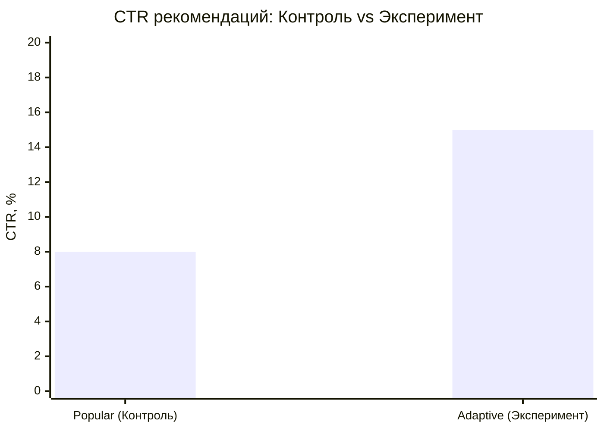
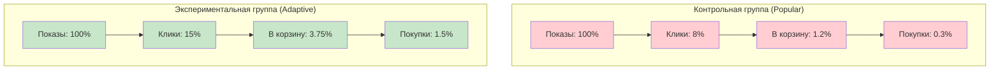
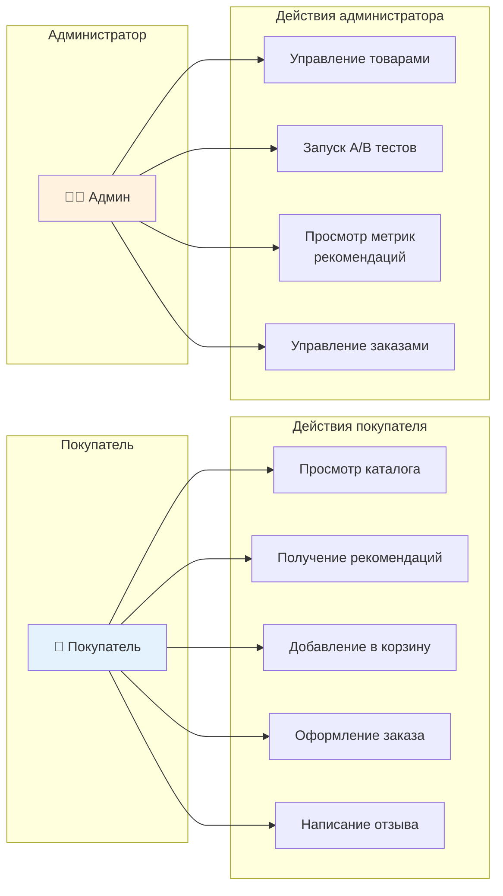

# Упрощённые диаграммы — Mermaid Source

## 1. Общая архитектура системы

---

## 2. ER-диаграмма — таблицы рекомендательной системы

---

## 3. Алгоритм генерации рекомендаций (блок-схема)

---

## 4. Формула гибридного алгоритма

---

## 5. Процесс A/B тестирования

---

## 6. Результаты — сравнение CTR

---

## 7. Воронка конверсии

---

## 8. Диаграмма вариантов использования (Use Case)

